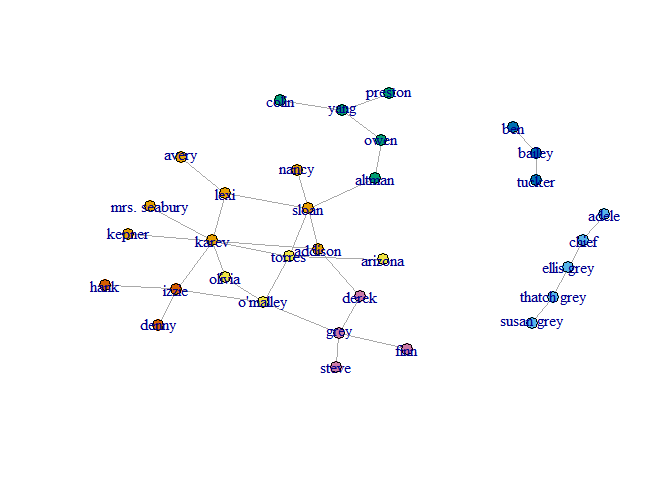

    folder = 'E:\\Sadna_Lamadan\\Assignment 3\\termDocMatrix'
    setwd(folder)

    #Or for all chuncks in this Rmarkdown:
    knitr::opts_knit$set(root.dir = folder)

install igraph:

    #install.packages("igraph")
    #install.packages("digest")
    #install.packages("rgl")
    #install.packages("base64enc")
    library(twitteR)
    library(httr)
    library(jsonlite)
    library(wordcloud)

    ## Loading required package: RColorBrewer

    library(tm)

    ## Loading required package: NLP

    ## 
    ## Attaching package: 'NLP'

    ## The following object is masked from 'package:httr':
    ## 
    ##     content

    library(base64enc)
    library(digest)
    library(rgl)
    library(igraph)

    ## 
    ## Attaching package: 'igraph'

    ## The following objects are masked from 'package:stats':
    ## 
    ##     decompose, spectrum

    ## The following object is masked from 'package:base':
    ## 
    ##     union

    library(rmarkdown)
    library(knitr)
    library(dplyr)

    ## 
    ## Attaching package: 'dplyr'

    ## The following objects are masked from 'package:igraph':
    ## 
    ##     as_data_frame, groups, union

    ## The following objects are masked from 'package:twitteR':
    ## 
    ##     id, location

    ## The following objects are masked from 'package:stats':
    ## 
    ##     filter, lag

    ## The following objects are masked from 'package:base':
    ## 
    ##     intersect, setdiff, setequal, union

Let's plot the grey anatomy characters' relationship graph

    ga.data <- read.csv('ga_edgelist.csv', header=TRUE, stringsAsFactors=FALSE)
    ga.vrtx <- read.csv('ga_actors.csv', header=TRUE, stringsAsFactors=FALSE)
    g <- graph.data.frame(ga.data, vertices=ga.vrtx, directed=FALSE)
    plot(g)

1a Calculate the max betweenness, closeness and eigenvector for the
largest component of the GA graph.

1a.1: Calculate the max betweenness for the largest component in g

First, we isolate the main component of g:

    main_component <- components(g, mode = c("strong"))$membership

    V(g)$comp <- main_component
    g_main_component <- induced_subgraph(g,V(g)$comp==1)
    plot(g_main_component)

We calculate the betweenness for all characters in the component

    calculated_betweenness <- betweenness(g_main_component, v = V(g_main_component), directed = FALSE, weights = NULL,
      nobigint = TRUE, normalized = FALSE)
    calculated_betweenness

    ##      addison       altman      arizona        avery        colin 
    ##     44.08333     76.00000      0.00000      0.00000      0.00000 
    ##        denny        derek         finn         grey         hank 
    ##      0.00000     17.95000      0.00000     46.86667      0.00000 
    ##        izzie        karev       kepner         lexi mrs. seabury 
    ##     47.95000     95.26667      0.00000     36.00000      0.00000 
    ##        nancy       olivia     o'malley         owen      preston 
    ##      0.00000      4.95000     54.41667     60.00000      0.00000 
    ##        sloan        steve       torres         yang 
    ##    115.36667      0.00000     67.15000     43.00000

Now, we extract the maximum betweenness value. The max betweenness value
is: Sloan (115.3667)

    max_betweenness <- max(calculated_betweenness)
    max_betweenness_character <- V(g_main_component)[as.numeric(which(calculated_betweenness == max_betweenness))]
    max_betweenness_character

    ## + 1/24 vertex, named, from 423d0f0:
    ## [1] sloan

    max_betweenness

    ## [1] 115.3667

1a.2: Calculate the max Closeness for the largest component in the graph

    calculated_closeness <- closeness(g_main_component, v = V(g_main_component), weights = NULL, normalized = FALSE)
    calculated_closeness

    ##      addison       altman      arizona        avery        colin 
    ##  0.016949153  0.013698630  0.012658228  0.011494253  0.007751938 
    ##        denny        derek         finn         grey         hank 
    ##  0.010989011  0.013698630  0.010101010  0.012987013  0.010989011 
    ##        izzie        karev       kepner         lexi mrs. seabury 
    ##  0.014492754  0.016949153  0.012345679  0.015384615  0.012345679 
    ##        nancy       olivia     o'malley         owen      preston 
    ##  0.012345679  0.013698630  0.015873016  0.011235955  0.007751938 
    ##        sloan        steve       torres         yang 
    ##  0.016949153  0.010101010  0.017543860  0.009345794

Now, extract the maximum closeness value. The max closeness value is:
Torres (0.01754386)

    max_closeness <- max(calculated_closeness)
    max_closeness_character <- V(g_main_component)[as.numeric(which(calculated_closeness == max_closeness))]
    max_closeness_character

    ## + 1/24 vertex, named, from 423d0f0:
    ## [1] torres

    max_closeness

    ## [1] 0.01754386

1a.3: Calculate the max Eigenvector for the largest component in the
graph

    calculated_eigenvector <- eigen_centrality(g_main_component, directed = FALSE, scale = TRUE, weights = NULL, options = arpack_defaults)
    calculated_eigenvector$vector

    ##      addison       altman      arizona        avery        colin 
    ##  0.553736435  0.207702396  0.210120473  0.153835832  0.007009961 
    ##        denny        derek         finn         grey         hank 
    ##  0.165489626  0.250030245  0.087953295  0.300492721  0.165489626 
    ##        izzie        karev       kepner         lexi mrs. seabury 
    ##  0.565395852  1.000000000  0.292696923  0.525580626  0.292696923 
    ##        nancy       olivia     o'malley         owen      preston 
    ##  0.187856429  0.468519243  0.600697535  0.067803814  0.007009961 
    ##        sloan        steve       torres         yang 
    ##  0.641812107  0.087953295  0.717877288  0.023949556

Now, extract the maximum eigenvector value. The max eigenvector value
is: Karev (1)

    max_eigenvector <- max(calculated_eigenvector$vector)
    max_eigenvector_character <- V(g_main_component)[as.numeric(which(calculated_eigenvector$vector == max_eigenvector))]
    max_eigenvector_character

    ## + 1/24 vertex, named, from 423d0f0:
    ## [1] karev

    max_eigenvector

    ## [1] 1

1b. Run 2 community detection algorithms and calculate their modularity
value First algorithm: Girvan-Newman We got 7 communities from this
algorithm, with a modularity of 0.58

    gc <-  edge.betweenness.community(g)
    gc

    ## IGRAPH clustering edge betweenness, groups: 7, mod: 0.58
    ## + groups:
    ##   $`1`
    ##   [1] "addison"      "avery"        "karev"        "kepner"      
    ##   [5] "lexi"         "mrs. seabury" "nancy"        "sloan"       
    ##   
    ##   $`2`
    ##   [1] "adele"       "chief"       "ellis grey"  "susan grey"  "thatch grey"
    ##   
    ##   $`3`
    ##   [1] "altman"  "colin"   "owen"    "preston" "yang"   
    ##   
    ##   + ... omitted several groups/vertices

Size of each community:

    gc <-  edge.betweenness.community(g)
    for (i in 1:length(gc)) {
      print(length(gc[[i]]))
    }

    ## [1] 8
    ## [1] 5
    ## [1] 5
    ## [1] 4
    ## [1] 3
    ## [1] 3
    ## [1] 4

    gc$modularity

    ##  [1] -0.04584775 -0.01773356  0.01081315  0.03849481  0.06617647
    ##  [6]  0.09472318  0.12326990  0.14965398  0.17560554  0.20285467
    ## [11]  0.23096886  0.25865052  0.28633218  0.31358131  0.34083045
    ## [16]  0.36894464  0.39576125  0.41479239  0.44247405  0.46712803
    ## [21]  0.49134948  0.50778547  0.52681661  0.54974048  0.57050173
    ## [26]  0.57742215  0.56098616  0.53416955  0.45804498  0.30449827

    max(gc$modularity)

    ## [1] 0.5774221

    which.max(gc$modularity)

    ## [1] 26

    #Store cluster ids for each vertex
    memb <- membership(gc)
    head(memb)

    ## addison   adele  altman arizona   avery  bailey 
    ##       1       2       3       4       1       5

Printed graph wit colorful communities:

    plot(g, vertex.size=5, #vertex.label=NA,
         vertex.color=memb, asp=FALSE)

Second algorithm: fastgreedy We got 6 communities with a modularity
value of 0.59

    g <- simplify(g)
    gc2 <-  fastgreedy.community(g)
    gc2

    ## IGRAPH clustering fast greedy, groups: 6, mod: 0.59
    ## + groups:
    ##   $`1`
    ##    [1] "arizona"      "denny"        "hank"         "izzie"       
    ##    [5] "karev"        "kepner"       "mrs. seabury" "olivia"      
    ##    [9] "o'malley"     "torres"      
    ##   
    ##   $`2`
    ##   [1] "addison" "derek"   "finn"    "grey"    "steve"  
    ##   
    ##   $`3`
    ##   [1] "avery" "lexi"  "nancy" "sloan"
    ##   + ... omitted several groups/vertices

Size of each community:

    gc2 <-  fastgreedy.community(g)
    for (i in 1:length(gc2)) {
      print(length(gc2[[i]]))
    }

    ## [1] 10
    ## [1] 5
    ## [1] 4
    ## [1] 5
    ## [1] 5
    ## [1] 3

colour the different communities

    plot(g,  vertex.size=5, vertex.label=NA,
         vertex.color=membership(gc2), asp=FALSE)

    plot(g,  vertex.size=5, vertex.label=NA,
         vertex.color=membership(gc2), asp=FALSE)

### PART TWO - analyze twitter data

    #install.packages("httr")
    #install.packages("base64enc")
    #install.packages("jsonlite")
    #install.packages("wordcloud")

Setting auth keys, manually:

    consumer_key <- "kiNWnLLgrBlHl95N4aaCc2WdQ"
    consumer_secret <- "EG5PlTAQOcGL5ZR2fZGtVHuaBlo2bye4ghwz5keMH2hnMfjuka"
    access_token <- "2910578695-eftACY3tttmbRES0KxOZJ8wKzArn1VIYJR4CFE3"
    access_secret <- "zDWms2z6dBLRNu8vXJX5nvO7lAmSdmJu3bWK8MqQhafG0"

    #sig <- setup_twitter_oauth(consumer_key, consumer_secret, access_token, access_secret)
    # start the authorisation process
    myapp = oauth_app("twitter", key=consumer_key, secret=consumer_secret)

    # sign using token and token secret
    sig1 = sign_oauth1.0(myapp, token=access_token, token_secret=access_secret)

Now let's get the last tweets in my home Timeline using the httr
package. httr works well with Facebook, Google, Twitter, Github, etc.
The URL we input above related to part of the Twitter API.

    my_timeline=GET("https://api.twitter.com/1.1/statuses/home_timeline.json", sig1)
    my_timeline

    ## Response [https://api.twitter.com/1.1/statuses/home_timeline.json]
    ##   Date: 2017-12-29 13:43
    ##   Status: 200
    ##   Content-Type: application/json;charset=utf-8
    ##   Size: 100 kB

    # Example: http://www.r-bloggers.com/downloading-your-twitter-feed-in-r/

    #Here we set up the OAuth credentials for a twitteR session:
    sig <- setup_twitter_oauth(consumer_key, consumer_secret, access_token, access_secret)

    ## [1] "Using direct authentication"

    #reading twits from home Timeline
    timeLine <- homeTimeline(n = 80, retryOnRateLimit = 5)

### 2.a and 2.b:

We decided to analyze the tweets of Donald Trump. We choose his 15
latest tweets, and turning the data into a corpus. Each word (after
cleaning) will be a vertex, and an edge between 2 words means that both
words appear in the same tweet. If a certain word is connected to many
other words, it might mean that it's part of a long tweet, but it might
also mean that it is repeated in many different tweets. We can know if
it is repeated in many tweets if it connects different communities,
because words that don't appear in more than 1 tweet will be mote
isolated since theyll only be connected to the other words in that
tweet. These are the tweets:

    realDonaldTrump_tweets <- userTimeline("realDonaldTrump", n=15)
    head(realDonaldTrump_tweets)

    ## [[1]]
    ## [1] "realDonaldTrump: The Democrats have been told, and fully understand, that there can be no DACA without the desperately needed WALL a… https://t.co/sjkgrE1kQe"
    ## 
    ## [[2]]
    ## [1] "realDonaldTrump: Why is the United States Post Office, which is losing many billions of dollars a year, while charging Amazon and ot… https://t.co/fHKlK5bmUe"
    ## 
    ## [[3]]
    ## [1] "realDonaldTrump: While the Fake News loves to talk about my so-called low approval rating, @foxandfriends just showed that my rating… https://t.co/u3cMWTck6M"
    ## 
    ## [[4]]
    ## [1] "realDonaldTrump: In the East, it could be the COLDEST New Year’s Eve on record. Perhaps we could use a little bit of that good old G… https://t.co/tCjF8xdXep"
    ## 
    ## [[5]]
    ## [1] "realDonaldTrump: Together, we are MAKING AMERICA GREAT AGAIN! https://t.co/OeyTdFyl1Q https://t.co/wdLQkfdy4m"
    ## 
    ## [[6]]
    ## [1] "realDonaldTrump: I've been saying it for a long, long time. #NoKo https://t.co/LQl7tGhMdO"

We turn the tweets into a corpus

     df <- do.call("rbind", lapply(realDonaldTrump_tweets, as.data.frame))
     library(tm)
     myCorpus <- Corpus(VectorSource(df$text))

We clean data by removing stopwords and applying tolower

     #install("base64enc")
     myCorpus<-tm_map(myCorpus, function(x) iconv(enc2utf8(x), sub = "byte"))
     myCorpus <- tm_map(myCorpus, tolower)
     myCorpus <- tm_map(myCorpus, removePunctuation)
     myCorpus <- tm_map(myCorpus, removeNumbers)
     myCorpus <- tm_map(myCorpus, removeWords, c(stopwords('english')))
     inspect(myCorpus)

    ## <<SimpleCorpus>>
    ## Metadata:  corpus specific: 1, document level (indexed): 0
    ## Content:  documents: 7
    ## 
    ## [1]  democrats   told  fully understand   can   daca without  desperately needed wall aג€¦ httpstcosjkgrekqe      
    ## [2]    united states post office   losing many billions  dollars  year  charging amazon  otג€¦ httpstcofhklkbmue  
    ## [3]   fake news loves  talk   socalled low approval rating foxandfriends just showed   ratingג€¦ httpstcoucmwtckm 
    ## [4]   east     coldest new yearג€™s eve  record perhaps   use  little bit   good old gג€¦ httpstcotcjfxdxep       
    ## [5] together   making america great  httpstcooeytdfylq httpstcowdlqkfdym                                          
    ## [6] ive  saying    long long time noko httpstcolqltghmdo                                                          
    ## [7] caught red handed   disappointed  china  allowing oil  go  north korea  will never   frieג€¦ httpstcoaiacfxnoa

We create a termDocumentMatrix. Docs are the tweets, Terms are the
words.

    myDtm <- TermDocumentMatrix(myCorpus, control = list(minWordLength = 4))
    inspect(myDtm)

    ## <<TermDocumentMatrix (terms: 77, documents: 7)>>
    ## Non-/sparse entries: 77/462
    ## Sparsity           : 86%
    ## Maximal term length: 17
    ## Weighting          : term frequency (tf)
    ## Sample             :
    ##                    Docs
    ## Terms               1 2 3 4 5 6 7
    ##   aג€               1 0 0 0 0 0 0
    ##   can               1 0 0 0 0 0 0
    ##   daca              1 0 0 0 0 0 0
    ##   democrats         1 0 0 0 0 0 0
    ##   desperately       1 0 0 0 0 0 0
    ##   fully             1 0 0 0 0 0 0
    ##   httpstcosjkgrekqe 1 0 0 0 0 0 0
    ##   long              0 0 0 0 0 2 0
    ##   needed            1 0 0 0 0 0 0
    ##   told              1 0 0 0 0 0 0

Now we turn it into a term-term adjacency matrix.

    # change it to a Boolean matrix
     myDtm[myDtm>=3] <- 1

     myDttm <- as.matrix(t(myDtm))
    out <- crossprod(myDttm)
    diag(out) <- 0       # (b/c you don't count co-occurrences of an aspect with itself)
    out[1:5,1:5]

    ##              Terms
    ## Terms         aג€ can daca democrats desperately
    ##   aג€           0   1    1         1           1
    ##   can           1   0    1         1           1
    ##   daca          1   1    0         1           1
    ##   democrats     1   1    1         0           1
    ##   desperately   1   1    1         1           0

### 2.c:

Now we turn it into a graph using igraph

     library(igraph)
     # build a graph from the above matrix
     g2 <- graph.adjacency(out, weighted=T, mode = "undirected")
     # remove loops
     g2 <- simplify(g2)
     # set labels and degrees of vertices
     V(g2)$label <- V(g2)$name
     V(g2)$degree <- degree(g2)
     plot(g2)

This is the graph we will be working with!

### 2.d:

Calculate Betweenness, Closeness and Eigenvector

-Betweenness: We calculate the betweenness for all words in the g2

    calculated_betweenness <- betweenness(g2, v = V(g2), directed = FALSE, weights = NULL,
      nobigint = TRUE, normalized = FALSE)
    head(calculated_betweenness)

    ##         aג€         can        daca   democrats desperately       fully 
    ##           0           0           0           0           0           0

Now, we extract the maximum betweenness value.

    max_betweenness <- max(calculated_betweenness)
    max_betweenness_character <- V(g2)[as.numeric(which(calculated_betweenness == max_betweenness))]
    max_betweenness_character

    ## + 77/77 vertices, named, from 4429abe:
    ##  [1] aג€               can               daca             
    ##  [4] democrats         desperately       fully            
    ##  [7] httpstcosjkgrekqe needed            told             
    ## [10] understand        wall              without          
    ## [13] amazon            billions          charging         
    ## [16] dollars           httpstcofhklkbmue losing           
    ## [19] many              office            otג€             
    ## [22] post              states            united           
    ## [25] year              approval          fake             
    ## [28] foxandfriends     httpstcoucmwtckm  just             
    ## + ... omitted several vertices

    max_betweenness

    ## [1] 0

-Calculate the Closeness

    calculated_closeness <- closeness(g2, v = V(g2), weights = NULL, normalized = FALSE)
    head(calculated_closeness)

    ##         aג€         can        daca   democrats desperately       fully 
    ## 0.000199362 0.000199362 0.000199362 0.000199362 0.000199362 0.000199362

Now, extract the maximum closeness value.

    max_closeness <- max(calculated_closeness)
    max_closeness_character <- V(g2)[as.numeric(which(calculated_closeness == max_closeness))]
    max_closeness_character

    ## + 14/77 vertices, named, from 4429abe:
    ##  [1] bit               coldest           east             
    ##  [4] eve               good              gג€              
    ##  [7] httpstcotcjfxdxep little            new              
    ## [10] old               perhaps           record           
    ## [13] use               yearג€™s

    max_closeness

    ## [1] 0.0002055921

-Calculate the Eigenvector

    calculated_eigenvector <- eigen_centrality(g2, directed = FALSE, scale = TRUE, weights = NULL, options = arpack_defaults)
    head(calculated_eigenvector$vector)

    ##          aג€          can         daca    democrats  desperately 
    ## 5.192593e-16 4.154074e-16 3.634815e-16 3.634815e-16 3.115556e-16 
    ##        fully 
    ## 4.673333e-16

Now, extract the maximum eigenvector value. The max eigenvector value
is: Karev (1)

    max_eigenvector <- max(calculated_eigenvector$vector)
    max_eigenvector_character <- V(g2)[as.numeric(which(calculated_eigenvector$vector == max_eigenvector))]
    max_eigenvector_character

    ## + 1/77 vertex, named, from 4429abe:
    ## [1] east

    max_eigenvector

    ## [1] 1

### Now for the second part - finding communities

Find communities using 2 different algorithms:

We apply Girvan\_newman to find communities. The size of each community
is listed below

    gc2 <-  edge.betweenness.community(g2)
    for (i in 1:length(gc2)) {
      print(length(gc2[[i]]))
    }

    ## [1] 12
    ## [1] 13
    ## [1] 13
    ## [1] 14
    ## [1] 6
    ## [1] 6
    ## [1] 13

See here how many groups were found and the modularity value:

    gc2

    ## IGRAPH clustering edge betweenness, groups: 7, mod: 0.83
    ## + groups:
    ##   $`1`
    ##    [1] "aג€"               "can"               "daca"             
    ##    [4] "democrats"         "desperately"       "fully"            
    ##    [7] "httpstcosjkgrekqe" "needed"            "told"             
    ##   [10] "understand"        "wall"              "without"          
    ##   
    ##   $`2`
    ##    [1] "amazon"            "billions"          "charging"         
    ##    [4] "dollars"           "httpstcofhklkbmue" "losing"           
    ##    [7] "many"              "office"            "otג€"             
    ##   + ... omitted several groups/vertices

Printed graph with colorful communities:

    memb <- membership(gc2)
    plot(g2, vertex.size=5, #vertex.label=NA,
         vertex.color=memb, asp=FALSE)

Now we will apply the second algorithm: fastgreedy
==================================================

    g2 <- simplify(g2)
    gc2 <-  fastgreedy.community(g2)
    gc2

    ## IGRAPH clustering fast greedy, groups: 7, mod: 0.83
    ## + groups:
    ##   $`1`
    ##    [1] "bit"               "coldest"           "east"             
    ##    [4] "eve"               "good"              "gג€"              
    ##    [7] "httpstcotcjfxdxep" "little"            "new"              
    ##   [10] "old"               "perhaps"           "record"           
    ##   [13] "use"               "yearג€™s"         
    ##   
    ##   $`2`
    ##    [1] "amazon"            "billions"          "charging"         
    ##    [4] "dollars"           "httpstcofhklkbmue" "losing"           
    ##   + ... omitted several groups/vertices

Size of each community:

    gc2 <-  fastgreedy.community(g2)
    for (i in 1:length(gc2)) {
      print(length(gc2[[i]]))
    }

    ## [1] 14
    ## [1] 13
    ## [1] 13
    ## [1] 13
    ## [1] 12
    ## [1] 6
    ## [1] 6

colour the different communities

    plot(g2,  vertex.size=5, vertex.label=NA,
         vertex.color=membership(gc2), asp=FALSE)

    plot(g2,  vertex.size=5, vertex.label=NA,
         vertex.color=membership(gc2), asp=FALSE)

