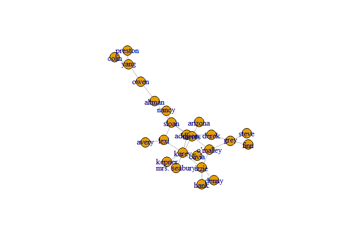
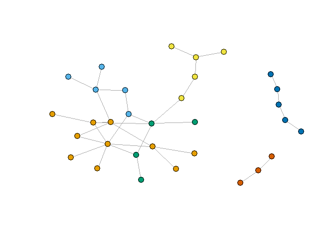
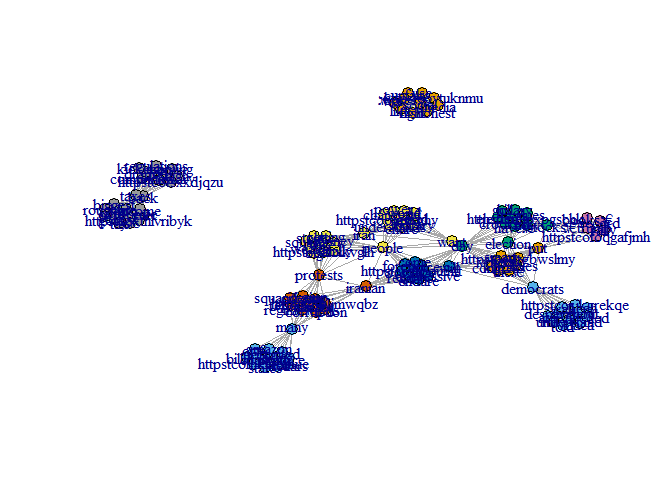
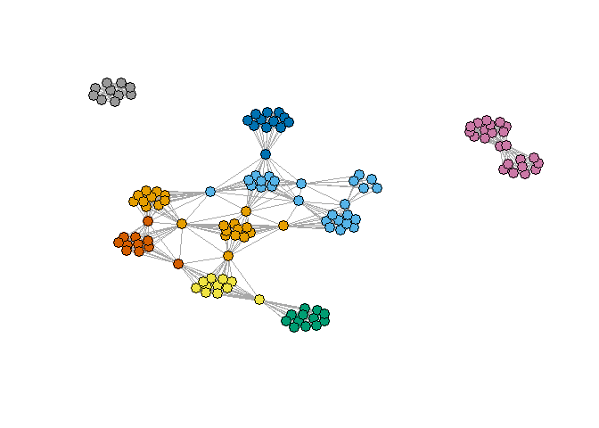

    folder = 'E:\\Sadna_Lamadan\\Assignment 3\\termDocMatrix'
    setwd(folder)

    #Or for all chuncks in this Rmarkdown:
    knitr::opts_knit$set(root.dir = folder)

install igraph:

    #install.packages("igraph")
    #install.packages("digest")
    #install.packages("rgl")
    #install.packages("base64enc")
    library(twitteR)
    library(httr)
    library(jsonlite)
    library(wordcloud)

    ## Loading required package: RColorBrewer

    library(tm)

    ## Loading required package: NLP

    ## 
    ## Attaching package: 'NLP'

    ## The following object is masked from 'package:httr':
    ## 
    ##     content

    library(base64enc)
    library(digest)
    library(rgl)
    library(igraph)

    ## 
    ## Attaching package: 'igraph'

    ## The following objects are masked from 'package:stats':
    ## 
    ##     decompose, spectrum

    ## The following object is masked from 'package:base':
    ## 
    ##     union

    library(rmarkdown)
    library(knitr)
    library(dplyr)

    ## 
    ## Attaching package: 'dplyr'

    ## The following objects are masked from 'package:igraph':
    ## 
    ##     as_data_frame, groups, union

    ## The following objects are masked from 'package:twitteR':
    ## 
    ##     id, location

    ## The following objects are masked from 'package:stats':
    ## 
    ##     filter, lag

    ## The following objects are masked from 'package:base':
    ## 
    ##     intersect, setdiff, setequal, union

Let's plot the grey anatomy characters' relationship graph

    ga.data <- read.csv('ga_edgelist.csv', header=TRUE, stringsAsFactors=FALSE)
    ga.vrtx <- read.csv('ga_actors.csv', header=TRUE, stringsAsFactors=FALSE)
    g <- graph.data.frame(ga.data, vertices=ga.vrtx, directed=FALSE)
    plot(g)

1a Calculate the max betweenness, closeness and eigenvector for the
largest component of the GA graph.

1a.1: Calculate the max betweenness for the largest component in g

First, we isolate the main component of g:

    main_component <- components(g, mode = c("strong"))$membership

    V(g)$comp <- main_component
    g_main_component <- induced_subgraph(g,V(g)$comp==1)
    plot(g_main_component)

We calculate the betweenness for all characters in the component

    calculated_betweenness <- betweenness(g_main_component, v = V(g_main_component), directed = FALSE, weights = NULL,
      nobigint = TRUE, normalized = FALSE)
    calculated_betweenness

    ##      addison       altman      arizona        avery        colin 
    ##     44.08333     76.00000      0.00000      0.00000      0.00000 
    ##        denny        derek         finn         grey         hank 
    ##      0.00000     17.95000      0.00000     46.86667      0.00000 
    ##        izzie        karev       kepner         lexi mrs. seabury 
    ##     47.95000     95.26667      0.00000     36.00000      0.00000 
    ##        nancy       olivia     o'malley         owen      preston 
    ##      0.00000      4.95000     54.41667     60.00000      0.00000 
    ##        sloan        steve       torres         yang 
    ##    115.36667      0.00000     67.15000     43.00000

Now, we extract the maximum betweenness value. The max betweenness value
is: Sloan (115.3667)

    max_betweenness <- max(calculated_betweenness)
    max_betweenness_character <- V(g_main_component)[as.numeric(which(calculated_betweenness == max_betweenness))]
    max_betweenness_character

    ## + 1/24 vertex, named, from 280347b:
    ## [1] sloan

    max_betweenness

    ## [1] 115.3667

1a.2: Calculate the max Closeness for the largest component in the graph

    calculated_closeness <- closeness(g_main_component, v = V(g_main_component), weights = NULL, normalized = FALSE)
    calculated_closeness

    ##      addison       altman      arizona        avery        colin 
    ##  0.016949153  0.013698630  0.012658228  0.011494253  0.007751938 
    ##        denny        derek         finn         grey         hank 
    ##  0.010989011  0.013698630  0.010101010  0.012987013  0.010989011 
    ##        izzie        karev       kepner         lexi mrs. seabury 
    ##  0.014492754  0.016949153  0.012345679  0.015384615  0.012345679 
    ##        nancy       olivia     o'malley         owen      preston 
    ##  0.012345679  0.013698630  0.015873016  0.011235955  0.007751938 
    ##        sloan        steve       torres         yang 
    ##  0.016949153  0.010101010  0.017543860  0.009345794

Now, extract the maximum closeness value. The max closeness value is:
Torres (0.01754386)

    max_closeness <- max(calculated_closeness)
    max_closeness_character <- V(g_main_component)[as.numeric(which(calculated_closeness == max_closeness))]
    max_closeness_character

    ## + 1/24 vertex, named, from 280347b:
    ## [1] torres

    max_closeness

    ## [1] 0.01754386

1a.3: Calculate the max Eigenvector for the largest component in the
graph

    calculated_eigenvector <- eigen_centrality(g_main_component, directed = FALSE, scale = TRUE, weights = NULL, options = arpack_defaults)
    calculated_eigenvector$vector

    ##      addison       altman      arizona        avery        colin 
    ##  0.553736435  0.207702396  0.210120473  0.153835832  0.007009961 
    ##        denny        derek         finn         grey         hank 
    ##  0.165489626  0.250030245  0.087953295  0.300492721  0.165489626 
    ##        izzie        karev       kepner         lexi mrs. seabury 
    ##  0.565395852  1.000000000  0.292696923  0.525580626  0.292696923 
    ##        nancy       olivia     o'malley         owen      preston 
    ##  0.187856429  0.468519243  0.600697535  0.067803814  0.007009961 
    ##        sloan        steve       torres         yang 
    ##  0.641812107  0.087953295  0.717877288  0.023949556

Now, extract the maximum eigenvector value. The max eigenvector value
is: Karev (1)

    max_eigenvector <- max(calculated_eigenvector$vector)
    max_eigenvector_character <- V(g_main_component)[as.numeric(which(calculated_eigenvector$vector == max_eigenvector))]
    max_eigenvector_character

    ## + 1/24 vertex, named, from 280347b:
    ## [1] karev

    max_eigenvector

    ## [1] 1

1b. Run 2 community detection algorithms and calculate their modularity
value First algorithm: Girvan-Newman We got 7 communities from this
algorithm, with a modularity of 0.58

    gc <-  edge.betweenness.community(g)
    gc

    ## IGRAPH clustering edge betweenness, groups: 7, mod: 0.58
    ## + groups:
    ##   $`1`
    ##   [1] "addison"      "avery"        "karev"        "kepner"      
    ##   [5] "lexi"         "mrs. seabury" "nancy"        "sloan"       
    ##   
    ##   $`2`
    ##   [1] "adele"       "chief"       "ellis grey"  "susan grey"  "thatch grey"
    ##   
    ##   $`3`
    ##   [1] "altman"  "colin"   "owen"    "preston" "yang"   
    ##   
    ##   + ... omitted several groups/vertices

Size of each community:

    gc <-  edge.betweenness.community(g)
    for (i in 1:length(gc)) {
      print(length(gc[[i]]))
    }

    ## [1] 8
    ## [1] 5
    ## [1] 5
    ## [1] 4
    ## [1] 3
    ## [1] 3
    ## [1] 4

    gc$modularity

    ##  [1] -0.04584775 -0.01773356  0.01081315  0.03849481  0.06617647
    ##  [6]  0.09472318  0.12326990  0.14965398  0.17560554  0.20285467
    ## [11]  0.23096886  0.25865052  0.28633218  0.31358131  0.34083045
    ## [16]  0.36894464  0.39576125  0.41479239  0.44247405  0.46712803
    ## [21]  0.49134948  0.50778547  0.52681661  0.54974048  0.57050173
    ## [26]  0.57742215  0.56098616  0.53416955  0.45804498  0.30449827

    max(gc$modularity)

    ## [1] 0.5774221

    which.max(gc$modularity)

    ## [1] 26

    #Store cluster ids for each vertex
    memb <- membership(gc)
    head(memb)

    ## addison   adele  altman arizona   avery  bailey 
    ##       1       2       3       4       1       5

Printed graph wit colorful communities:

    plot(g, vertex.size=5, #vertex.label=NA,
         vertex.color=memb, asp=FALSE)

Second algorithm: fastgreedy We got 6 communities with a modularity
value of 0.59

    g <- simplify(g)
    gc2 <-  fastgreedy.community(g)
    gc2

    ## IGRAPH clustering fast greedy, groups: 6, mod: 0.59
    ## + groups:
    ##   $`1`
    ##    [1] "arizona"      "denny"        "hank"         "izzie"       
    ##    [5] "karev"        "kepner"       "mrs. seabury" "olivia"      
    ##    [9] "o'malley"     "torres"      
    ##   
    ##   $`2`
    ##   [1] "addison" "derek"   "finn"    "grey"    "steve"  
    ##   
    ##   $`3`
    ##   [1] "avery" "lexi"  "nancy" "sloan"
    ##   + ... omitted several groups/vertices

Size of each community:

    gc2 <-  fastgreedy.community(g)
    for (i in 1:length(gc2)) {
      print(length(gc2[[i]]))
    }

    ## [1] 10
    ## [1] 5
    ## [1] 4
    ## [1] 5
    ## [1] 5
    ## [1] 3

colour the different communities

    plot(g,  vertex.size=5, vertex.label=NA,
         vertex.color=membership(gc2), asp=FALSE)

    plot(g,  vertex.size=5, vertex.label=NA,
         vertex.color=membership(gc2), asp=FALSE)

### PART TWO - analyze twitter data

    #install.packages("httr")
    #install.packages("base64enc")
    #install.packages("jsonlite")
    #install.packages("wordcloud")

Setting auth keys, manually:

    consumer_key <- "kiNWnLLgrBlHl95N4aaCc2WdQ"
    consumer_secret <- "EG5PlTAQOcGL5ZR2fZGtVHuaBlo2bye4ghwz5keMH2hnMfjuka"
    access_token <- "2910578695-eftACY3tttmbRES0KxOZJ8wKzArn1VIYJR4CFE3"
    access_secret <- "zDWms2z6dBLRNu8vXJX5nvO7lAmSdmJu3bWK8MqQhafG0"

    #sig <- setup_twitter_oauth(consumer_key, consumer_secret, access_token, access_secret)
    # start the authorisation process
    myapp = oauth_app("twitter", key=consumer_key, secret=consumer_secret)

    # sign using token and token secret
    sig1 = sign_oauth1.0(myapp, token=access_token, token_secret=access_secret)

Now let's get the last tweets in my home Timeline using the httr
package. httr works well with Facebook, Google, Twitter, Github, etc.
The URL we input above related to part of the Twitter API.

    my_timeline=GET("https://api.twitter.com/1.1/statuses/home_timeline.json", sig1)
    my_timeline

    ## Response [https://api.twitter.com/1.1/statuses/home_timeline.json]
    ##   Date: 2017-12-31 16:53
    ##   Status: 200
    ##   Content-Type: application/json;charset=utf-8
    ##   Size: 94.7 kB

    # Example: http://www.r-bloggers.com/downloading-your-twitter-feed-in-r/

    #Here we set up the OAuth credentials for a twitteR session:
    sig <- setup_twitter_oauth(consumer_key, consumer_secret, access_token, access_secret)

    ## [1] "Using direct authentication"

    #reading twits from home Timeline
    timeLine <- homeTimeline(n = 80, retryOnRateLimit = 5)

### 2.a and 2.b:

We decided to analyze the tweets of Donald Trump. We choose his 15
latest tweets, and turning the data into a corpus. Each word (after
cleaning) will be a vertex, and an edge between 2 words means that both
words appear in the same tweet. If a certain word is connected to many
other words, it might mean that it's part of a long tweet, but it might
also mean that it is repeated in many different tweets. We can know if
it is repeated in many tweets if it connects different communities,
because words that don't appear in more than 1 tweet will be mote
isolated since theyll only be connected to the other words in that
tweet. These are the tweets:

    realDonaldTrump_tweets <- userTimeline("realDonaldTrump", n=15)
    head(realDonaldTrump_tweets)

    ## [[1]]
    ## [1] "realDonaldTrump: Why would smart voters want to put Democrats in Congress in 2018 Election when their policies will totally kill the… https://t.co/u7zgBWSLMY"
    ## 
    ## [[2]]
    ## [1] "realDonaldTrump: If the Dems (Crooked Hillary) got elected, your stocks would be down 50% from values on Election Day. Now they have… https://t.co/eJOxPGScHK"
    ## 
    ## [[3]]
    ## [1] "realDonaldTrump: Big protests in Iran. The people are finally getting wise as to how their money and wealth is being stolen and squa… https://t.co/3AhXkVG6Lh"
    ## 
    ## [[4]]
    ## [1] "realDonaldTrump: “Trump Rally: Stocks put 2017 in the record books” https://t.co/0foQGaFjMh"
    ## 
    ## [[5]]
    ## [1] "realDonaldTrump: Jobs are kicking in and companies are coming back to the U.S. Unnecessary regulations and high taxes are being dram… https://t.co/ts9xxdjQzU"
    ## 
    ## [[6]]
    ## [1] "realDonaldTrump: I use Social Media not because I like to, but because it is the only way to fight a VERY dishonest and unfair “pres… https://t.co/1YTuk89nmu"

We turn the tweets into a corpus

     df <- do.call("rbind", lapply(realDonaldTrump_tweets, as.data.frame))
     library(tm)
     myCorpus <- Corpus(VectorSource(df$text))

We clean data by removing stopwords and applying tolower

     #install("base64enc")
     myCorpus<-tm_map(myCorpus, function(x) iconv(enc2utf8(x), sub = "byte"))
     myCorpus <- tm_map(myCorpus, tolower)
     myCorpus <- tm_map(myCorpus, removePunctuation)
     myCorpus <- tm_map(myCorpus, removeNumbers)
     myCorpus <- tm_map(myCorpus, removeWords, c(stopwords('english')))
     inspect(myCorpus)

    ## <<SimpleCorpus>>
    ## Metadata:  corpus specific: 1, document level (indexed): 0
    ## Content:  documents: 12
    ## 
    ##  [1]   smart voters want  put democrats  congress   election   policies will totally kill theג€¦ httpstcouzgbwslmy            
    ##  [2]   dems crooked hillary got elected  stocks      values  election day now  haveג€¦ httpstcoejoxpgschk                     
    ##  [3] big protests  iran  people  finally getting wise     money  wealth   stolen  squaג€¦ httpstcoahxkvglh                    
    ##  [4] ג€œtrump rally stocks put    record booksג€ httpstcofoqgafjmh                                                           
    ##  [5] jobs  kicking   companies  coming back   us unnecessary regulations  high taxes   dramג€¦ httpstcotsxxdjqzu              
    ##  [6]  use social media    like        way  fight   dishonest  unfair ג€œpresג€¦ httpstcoytuknmu                               
    ##  [7]  taxes ג€œ   biggest corporate rate cut ever going back   corporate income tax rate  roughly  yג€¦ httpstcoxthivribyk    
    ##  [8] oppressive regimes  endure forever   day will come   iranian people will face  choice  worג€¦ httpstcoefpoufhft          
    ##  [9]  entire world understands   good people  iran want change     vast military power  tג€¦ httpstcoojmfsghy                 
    ## [10] many reports  peaceful protests  iranian citizens fed   regimeג€™s corruption amp  squandering   natiג€¦ httpstcobljmwqbz
    ## [11]  democrats   told  fully understand   can   daca without  desperately needed wall aג€¦ httpstcosjkgrekqe                 
    ## [12]    united states post office   losing many billions  dollars  year  charging amazon  otג€¦ httpstcofhklkbmue

We create a termDocumentMatrix. Docs are the tweets, Terms are the
words.

    myDtm <- TermDocumentMatrix(myCorpus, control = list(minWordLength = 4))
    inspect(myDtm)

    ## <<TermDocumentMatrix (terms: 128, documents: 12)>>
    ## Non-/sparse entries: 143/1393
    ## Sparsity           : 91%
    ## Maximal term length: 18
    ## Weighting          : term frequency (tf)
    ## Sample             :
    ##            Docs
    ## Terms       1 10 11 12 2 3 5 7 8 9
    ##   day       0  0  0  0 1 0 0 0 1 0
    ##   democrats 1  0  1  0 0 0 0 0 0 0
    ##   election  1  0  0  0 1 0 0 0 0 0
    ##   iran      0  0  0  0 0 1 0 0 0 1
    ##   people    0  0  0  0 0 1 0 0 1 1
    ##   protests  0  1  0  0 0 1 0 0 0 0
    ##   put       1  0  0  0 0 0 0 0 0 0
    ##   stocks    0  0  0  0 1 0 0 0 0 0
    ##   want      1  0  0  0 0 0 0 0 0 1
    ##   will      1  0  0  0 0 0 0 0 2 0

Now we turn it into a term-term adjacency matrix.

    # change it to a Boolean matrix
     myDtm[myDtm>=3] <- 1

     myDttm <- as.matrix(t(myDtm))
    out <- crossprod(myDttm)
    diag(out) <- 0       # (b/c you don't count co-occurrences of an aspect with itself)
    out[1:5,1:5]

    ##                    Terms
    ## Terms               congress democrats election httpstcouzgbwslmy kill
    ##   congress                 0         1        1                 1    1
    ##   democrats                1         0        1                 1    1
    ##   election                 1         1        0                 1    1
    ##   httpstcouzgbwslmy        1         1        1                 0    1
    ##   kill                     1         1        1                 1    0

### 2.c:

Now we turn it into a graph using igraph

     library(igraph)
     # build a graph from the above matrix
     g2 <- graph.adjacency(out, weighted=T, mode = "undirected")
     # remove loops
     g2 <- simplify(g2)
     # set labels and degrees of vertices
     V(g2)$label <- V(g2)$name
     V(g2)$degree <- degree(g2)
     plot(g2)

This is the graph we will be working with!

### 2.d:

Calculate Betweenness, Closeness and Eigenvector

-Betweenness: We calculate the betweenness for all words in the g2

    calculated_betweenness <- betweenness(g2, v = V(g2), directed = FALSE, weights = NULL,
      nobigint = TRUE, normalized = FALSE)
    head(calculated_betweenness)

    ##          congress         democrats          election httpstcouzgbwslmy 
    ##             0.000           913.000           457.875             0.000 
    ##              kill          policies 
    ##             0.000             0.000

Now, we extract the maximum betweenness value.

    max_betweenness <- max(calculated_betweenness)
    max_betweenness_character <- V(g2)[as.numeric(which(calculated_betweenness == max_betweenness))]
    max_betweenness_character

    ## + 1/128 vertex, named, from 2a24187:
    ## [1] iranian

    max_betweenness

    ## [1] 1020.35

-Calculate the Closeness

    calculated_closeness <- closeness(g2, v = V(g2), weights = NULL, normalized = FALSE)
    head(calculated_closeness)

    ##          congress         democrats          election httpstcouzgbwslmy 
    ##      0.0002233140      0.0002238639      0.0002255300      0.0002233140 
    ##              kill          policies 
    ##      0.0002233140      0.0002233140

Now, extract the maximum closeness value.

    max_closeness <- max(calculated_closeness)
    max_closeness_character <- V(g2)[as.numeric(which(calculated_closeness == max_closeness))]
    max_closeness_character

    ## + 1/128 vertex, named, from 2a24187:
    ## [1] people

    max_closeness

    ## [1] 0.0002268603

-Calculate the Eigenvector

    calculated_eigenvector <- eigen_centrality(g2, directed = FALSE, scale = TRUE, weights = NULL, options = arpack_defaults)
    head(calculated_eigenvector$vector)

    ##          congress         democrats          election httpstcouzgbwslmy 
    ##                 0                 0                 0                 0 
    ##              kill          policies 
    ##                 0                 0

Now, extract the maximum eigenvector value.

    max_eigenvector <- max(calculated_eigenvector$vector)
    max_eigenvector_character <- V(g2)[as.numeric(which(calculated_eigenvector$vector == max_eigenvector))]
    max_eigenvector_character

    ## + 1/128 vertex, named, from 2a24187:
    ## [1] rate

    max_eigenvector

    ## [1] 1

### Now for the second part - finding communities

Find communities using 2 different algorithms:

We apply Girvan\_newman to find communities. The size of each community
is listed below

    gc2 <-  edge.betweenness.community(g2)
    for (i in 1:length(gc2)) {
      print(length(gc2[[i]]))
    }

    ## [1] 9
    ## [1] 12
    ## [1] 12
    ## [1] 22
    ## [1] 10
    ## [1] 12
    ## [1] 5
    ## [1] 23
    ## [1] 10
    ## [1] 13

See here how many groups were found and the modularity value:

    gc2

    ## IGRAPH clustering edge betweenness, groups: 10, mod: 0.74
    ## + groups:
    ##   $`1`
    ##   [1] "congress"          "httpstcouzgbwslmy" "kill"             
    ##   [4] "policies"          "put"               "smart"            
    ##   [7] "theג€"             "totally"           "voters"           
    ##   
    ##   $`2`
    ##    [1] "democrats"         "aג€"               "can"              
    ##    [4] "daca"              "desperately"       "fully"            
    ##    [7] "httpstcosjkgrekqe" "needed"            "told"             
    ##   [10] "understand"        "wall"              "without"          
    ##   + ... omitted several groups/vertices

Printed graph with colorful communities:

    memb <- membership(gc2)
    plot(g2, vertex.size=5, #vertex.label=NA,
         vertex.color=memb, asp=FALSE)

Now we will apply the second algorithm: fastgreedy
==================================================

    g2 <- simplify(g2)
    gc2 <-  fastgreedy.community(g2)
    gc2

    ## IGRAPH clustering fast greedy, groups: 9, mod: 0.73
    ## + groups:
    ##   $`1`
    ##    [1] "change"           "entire"           "good"            
    ##    [4] "httpstcoojmfsghy" "military"         "power"           
    ##    [7] "tג€"              "understands"      "vast"            
    ##   [10] "world"           
    ##   
    ##   $`2`
    ##    [1] "congress"           "election"           "httpstcouzgbwslmy" 
    ##    [4] "kill"               "policies"           "put"               
    ##    [7] "smart"              "theג€"              "totally"           
    ##   + ... omitted several groups/vertices

Size of each community:

    gc2 <-  fastgreedy.community(g2)
    for (i in 1:length(gc2)) {
      print(length(gc2[[i]]))
    }

    ## [1] 10
    ## [1] 26
    ## [1] 12
    ## [1] 11
    ## [1] 12
    ## [1] 11
    ## [1] 23
    ## [1] 10
    ## [1] 13

colour the different communities

    plot(g2,  vertex.size=5, vertex.label=NA,
         vertex.color=membership(gc2), asp=FALSE)

    plot(g2,  vertex.size=5, vertex.label=NA,
         vertex.color=membership(gc2), asp=FALSE)

